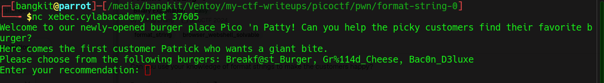
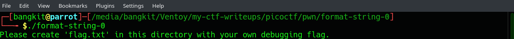
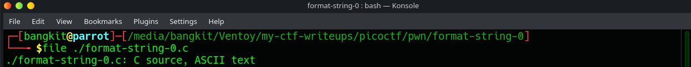
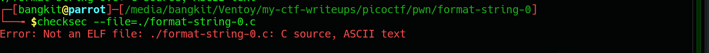
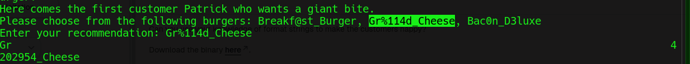
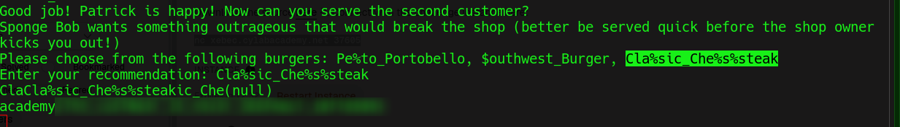

# format-string-0

### Category 
PWN / Binary Exploitation.

### Description
> Can you use your knowledge of format strings to make the customers happy?

### Author
Cheng Zhang

### Source
[format-string-0](https://learn.cylabacademy.org/library/433?page=1&category=6&workspace=true).

Diberikan source code format-string-0.c sebagai berikut:

```C
#include <stdio.h>
#include <stdlib.h>
#include <string.h>
#include <signal.h>
#include <unistd.h>
#include <sys/types.h>

#define BUFSIZE 32
#define FLAGSIZE 64

char flag[FLAGSIZE];

void sigsegv_handler(int sig) {
    printf("\n%s\n", flag);
    fflush(stdout);
    exit(1);
}

int on_menu(char *burger, char *menu[], int count) {
    for (int i = 0; i < count; i++) {
        if (strcmp(burger, menu[i]) == 0)
            return 1;
    }
    return 0;
}

void serve_patrick();

void serve_bob();


int main(int argc, char **argv){
    FILE *f = fopen("flag.txt", "r");
    if (f == NULL) {
        printf("%s %s", "Please create 'flag.txt' in this directory with your",
                        "own debugging flag.\n");
        exit(0);
    }

    fgets(flag, FLAGSIZE, f);
    signal(SIGSEGV, sigsegv_handler);

    gid_t gid = getegid();
    setresgid(gid, gid, gid);

    serve_patrick();
  
    return 0;
}

void serve_patrick() {
    printf("%s %s\n%s\n%s %s\n%s",
            "Welcome to our newly-opened burger place Pico 'n Patty!",
            "Can you help the picky customers find their favorite burger?",
            "Here comes the first customer Patrick who wants a giant bite.",
            "Please choose from the following burgers:",
            "Breakf@st_Burger, Gr%114d_Cheese, Bac0n_D3luxe",
            "Enter your recommendation: ");
    fflush(stdout);

    char choice1[BUFSIZE];
    scanf("%s", choice1);
    char *menu1[3] = {"Breakf@st_Burger", "Gr%114d_Cheese", "Bac0n_D3luxe"};
    if (!on_menu(choice1, menu1, 3)) {
        printf("%s", "There is no such burger yet!\n");
        fflush(stdout);
    } else {
        int count = printf(choice1);
        if (count > 2 * BUFSIZE) {
            serve_bob();
        } else {
            printf("%s\n%s\n",
                    "Patrick is still hungry!",
                    "Try to serve him something of larger size!");
            fflush(stdout);
        }
    }
}

void serve_bob() {
    printf("\n%s %s\n%s %s\n%s %s\n%s",
            "Good job! Patrick is happy!",
            "Now can you serve the second customer?",
            "Sponge Bob wants something outrageous that would break the shop",
            "(better be served quick before the shop owner kicks you out!)",
            "Please choose from the following burgers:",
            "Pe%to_Portobello, $outhwest_Burger, Cla%sic_Che%s%steak",
            "Enter your recommendation: ");
    fflush(stdout);

    char choice2[BUFSIZE];
    scanf("%s", choice2);
    char *menu2[3] = {"Pe%to_Portobello", "$outhwest_Burger", "Cla%sic_Che%s%steak"};
    if (!on_menu(choice2, menu2, 3)) {
        printf("%s", "There is no such burger yet!\n");
        fflush(stdout);
    } else {
        printf(choice2);
        fflush(stdout);
    }
}
```
lalu, ketika program dijalankan maka akan muncul seperti ini:


atau jika melakukan pengujian dilokal maka akan muncul seperti ini


solusinya buat file flag.txt dan jalankan ulang projectnya.

## Exploitation
Sebelum melakukan exploitasi, saya cek terlebih dahulu file dan security nya.

#### File

```bash
file ./chall
```
outputnya


#### Checksec

```bash
checksec --file=./chall
```
outputnya


Dari kedua langkah diatas bisa diketahui bahwa file format-string-0.c ini bukan file executable biasa melainkan file ASCII string, sesuai dengan namanya.

Lalu, deskripsi dan hint mengatakan cukup jelas dimana kita harus memilih jawaban yang sesuai dengan soal yang diberikan sekaligus belajar bagaimana cara kerja Format String Exploit.

1. Pertanyaan pertama



2. Pertanyaan kedua dan flag



### Learning Resources
[pwn.college-format-string-exploits](https://pwn.college/software-exploitation/format-string-exploits)


