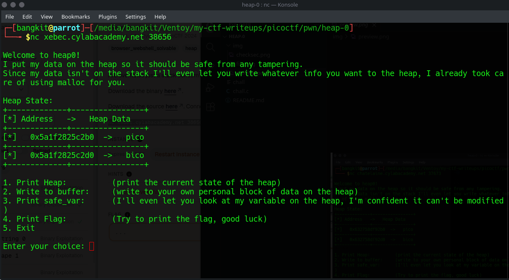
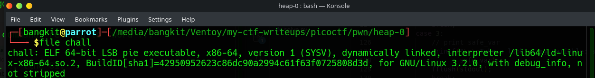
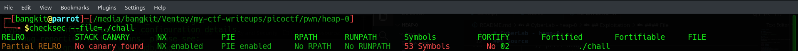
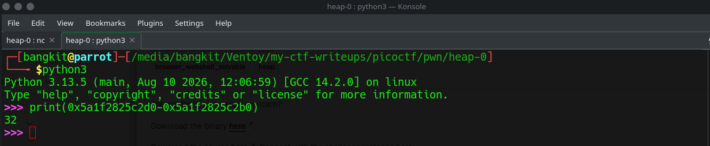
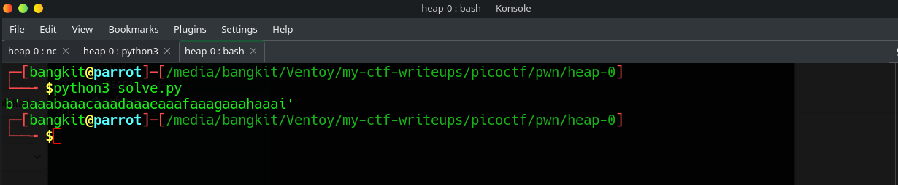
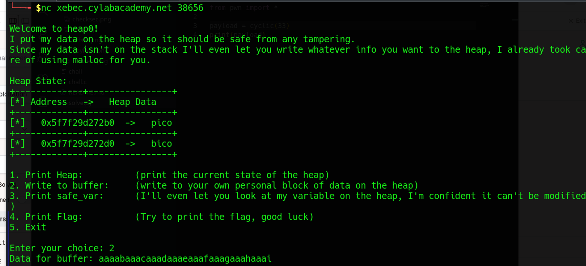
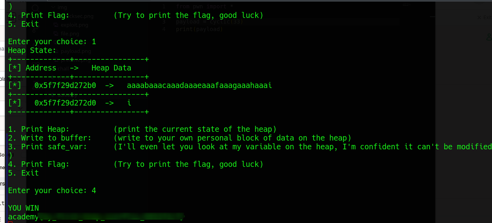

# heap-0

### Category 
PWN / Binary Exploitation.

### Description
> Are overflows just a stack concern?

### Author
Abrxs, pr1or1tyQ

### Source
[heap-0](https://learn.cylabacademy.org/library/438?page=1&category=6&workspace=true).

Diberikan source code chall.c sebagai berikut:
```C
#include <stdio.h>
#include <stdlib.h>
#include <string.h>

#define FLAGSIZE_MAX 64
// amount of memory allocated for input_data
#define INPUT_DATA_SIZE 5
// amount of memory allocated for safe_var
#define SAFE_VAR_SIZE 5

int num_allocs;
char *safe_var;
char *input_data;

void check_win() {
    if (strcmp(safe_var, "bico") != 0) {
        printf("\nYOU WIN\n");

        // Print flag
        char buf[FLAGSIZE_MAX];
        FILE *fd = fopen("flag.txt", "r");
        fgets(buf, FLAGSIZE_MAX, fd);
        printf("%s\n", buf);
        fflush(stdout);

        exit(0);
    } else {
        printf("Looks like everything is still secure!\n");
        printf("\nNo flage for you :(\n");
        fflush(stdout);
    }
}

void print_menu() {
    printf("\n1. Print Heap:\t\t(print the current state of the heap)"
           "\n2. Write to buffer:\t(write to your own personal block of data "
           "on the heap)"
           "\n3. Print safe_var:\t(I'll even let you look at my variable on "
           "the heap, "
           "I'm confident it can't be modified)"
           "\n4. Print Flag:\t\t(Try to print the flag, good luck)"
           "\n5. Exit\n\nEnter your choice: ");
    fflush(stdout);
}

void init() {
    printf("\nWelcome to heap0!\n");
    printf(
        "I put my data on the heap so it should be safe from any tampering.\n");
    printf("Since my data isn't on the stack I'll even let you write whatever "
           "info you want to the heap, I already took care of using malloc for "
           "you.\n\n");
    fflush(stdout);
    input_data = malloc(INPUT_DATA_SIZE);
    strncpy(input_data, "pico", INPUT_DATA_SIZE);
    safe_var = malloc(SAFE_VAR_SIZE);
    strncpy(safe_var, "bico", SAFE_VAR_SIZE);
}

void write_buffer() {
    printf("Data for buffer: ");
    fflush(stdout);
    scanf("%s", input_data);
}

void print_heap() {
    printf("Heap State:\n");
    printf("+-------------+----------------+\n");
    printf("[*] Address   ->   Heap Data   \n");
    printf("+-------------+----------------+\n");
    printf("[*]   %p  ->   %s\n", input_data, input_data);
    printf("+-------------+----------------+\n");
    printf("[*]   %p  ->   %s\n", safe_var, safe_var);
    printf("+-------------+----------------+\n");
    fflush(stdout);
}

int main(void) {

    // Setup
    init();
    print_heap();

    int choice;

    while (1) {
        print_menu();
	int rval = scanf("%d", &choice);
	if (rval == EOF){
	    exit(0);
	}
        if (rval != 1) {
            //printf("Invalid input. Please enter a valid choice.\n");
            //fflush(stdout);
            // Clear input buffer
            //while (getchar() != '\n');
            //continue;
	    exit(0);
        }

        switch (choice) {
        case 1:
            // print heap
            print_heap();
            break;
        case 2:
            write_buffer();
            break;
        case 3:
            // print safe_var
            printf("\n\nTake a look at my variable: safe_var = %s\n\n",
                   safe_var);
            fflush(stdout);
            break;
        case 4:
            // Check for win condition
            check_win();
            break;
        case 5:
            // exit
            return 0;
        default:
            printf("Invalid choice\n");
            fflush(stdout);
        }
    }
}
```
lalu, ketika program dijalankan maka akan muncul seperti ini:


## Exploitation
Sebelum melakukan exploitasi, saya cek terlebih dahulu file dan juga securitynya, sebagai berikut

#### File
```bash
file ./chall
```
outputnya


#### Checksec
```bash
checksec --file=./chall
```

outputnya

- **Partial Relro**
- **No Canary Found** 
- **NX Enabled**
- **PIE Enabled** Setiap program dijalankan maka address position nya akan selalu berubah, tetapi offset nya tetap

Dari semua informasi yang sudah saya kumpulkan maka kita perlu melakukan exploitasi agar input yang kita berikan mencapai stack pada "bico" sehingga memicu Segmentation Fault, kita nenggunakan teknik ini dinamakan HEAP Overflow

1. Hitung offset bico dan pico


pico perlu 32 bytes untuk mencapai ke bico, artinya jika input yang kita masukkan melebihi 32 bytes maka akan terjadi overflow dan memicu flagnya.

2. Susun payloadnya sebagai berikut

```python
from pwn import *

payload = cyclic(33)
print(payload)
```


3. Masukkan payloadnya ke opsi 2


Ketika heap melebih batas bico yaitu 32 bytes dan bico ditimpa dengan payload yang kita masukkan tadi maka akan memicu check_win()




