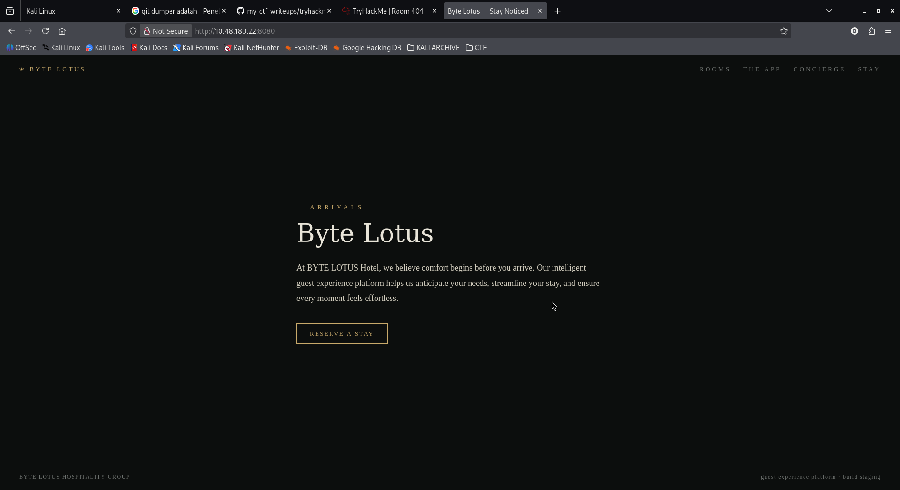

# TryHackMe - Room 404

### Category 
Web Exploitation.

### Description
> He booked the quiet room. It's not on the floor plan, not in the brochure, not on any door. But port 8080 is wide open, and the rooms it never lists are the ones worth finding.


### Source
[Room 404](https://tryhackme.com/room/hh-room404-804573bf).

## Solution
Diberikan website sebagai berikut

Seperti keterangan ada di deskripsi soal,beberapa halaman website ini tidak bisa dikunjungi dengan cara yang biasa, sehingga kita hanya bisa mengunjungi halaman utamanya saja. Namun, ada clue lain yang diberikan di soal itu yaitu Directory Enumeration, artinya kita perlu melakukan scanning pada halaman website untuk menemukan file atau direktori apa saja yang ada diwebsite target ini.

### 01 Recon
Langkah awal Recon untuk mengumpulkan data target, saya mulai melakukan scanning dengan nmap sebagai berikut
```bash
nmap -sC -sV -oN scan-1.txt 10.49.169.199
# sC = scan common vulnerability and miss configuration with default script
# sV = Probe open ports to determine service/version info
# oN = save output scan to file, eg .txt
# 10.x.x = IP target
```


